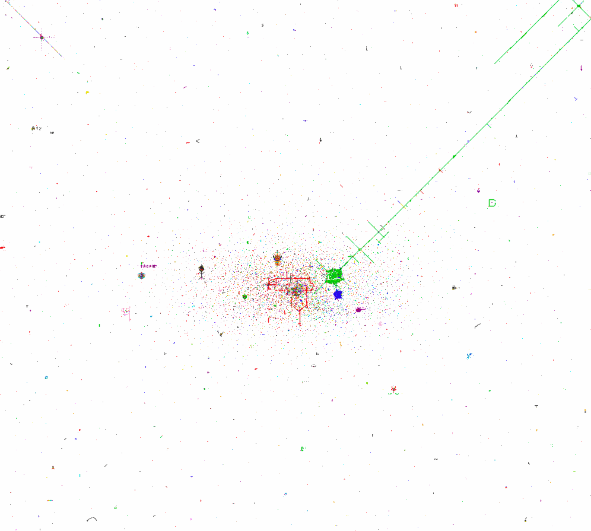

# /r/place Timeline
On April 1, 2017 Reddit created a social experiment which allowed users to place a single pixel on a canvas every 5 minutes. What happened over the next few days was nothing short of amazing. The internet created a beautiful piece of artwork.

Using the tile placement CSV data this project replays the timeline of /r/place using Python, Elasticsearch, and a bit of JavaScript. The project places 1 minute of historical pixels every millisecond.

Example output of this project:


## Prerequisites
 1. Python 2.7
 2. Pyhton VirtualEnv `pip install virtualenv`
 3. Node 7.9.0 or greater `brew install node`
 4. Webpack `npm install -g webpack`
 5. [Elasticsearch 5.3 or greater](https://artifacts.elastic.co/downloads/elasticsearch/elasticsearch-5.3.1.zip)
 6. [Tile placements GZipped CSV data](https://storage.googleapis.com/place_events/tile_placements.csv.gz)

## Overview
The following instructions will describe how to set up Elasticsearch and load the tile data into it. The instructions will help you get going with the API and client-side code.

The instructions are tested on OSX 10.12.

These instructions will walk through:

* [Setup](#setup)
* [Loading Data](#loading-data)
* [Starting the Web Service](#starting-the-web-service)
* [Build and Run Web Application](#build-and-run-web-application)

## <a name="setup"></a>Setup

### 1. Download the Data
The tile placements GZipped CSV file is roughly 500megs. Ungzipped the data is about 800megs.

##### Download the tile_placements.csv.gz:

```
curl -O https://storage.googleapis.com/place_events/tile_placements.csv.gz
```

##### Ungzip the file:

```
gzip -d tile_placements.csv.gz
``` 

### 2. Download and Start Elasticsearch
The following steps assume little knowledge of Elasticsearch.

##### Download Elasticsearch:

```
curl -O \
https://artifacts.elastic.co/downloads/elasticsearch/elasticsearch-5.3.1.zip
```

##### Unzip Elasticsearch:
```
unzip elasticsearch-5.3.1.zip 
```

##### Start Elasticsearch:
```
elasticsearch-5.3.1/bin/elasticsearch
```

At this point you should see Elasticsearch initialize and start. If everything starts fine you should see something like this:
```
[2017-01-21T12:45:47,806][INFO ][o.e.n.Node               ] [D7HJFUo] started
```

### 3. Initialize Python Virtual Environment
Back in the project directory, we need to create a virtual environment and install the python dependencies.

Do the following:

```
place$ cd py
place/py$ virtualenv venv
place/py$ source venv/bin/activate
(venv) place/py$ pip install -r requirements.txt
```

## <a name="loading-data"></a>Loading Data
Once the environment is set up we need to load the tile placement data into Elasticsearch. `load.py` located in the `py` directory is a simple script which reads the `title_placements.csv` and loads the data into an index in Elasticsearch.

This script assumes Elasticsearch is running and the virtual environment is setup and activated.

To load the data execute the following command:

```
(venv) place/py$ python load.py -f ../path/to/tile_placements.csv
```

The CSV has 16 million rows. It will take some time complete. You can monitor the count of rows loaded into Elasticsearch by using Elasticsearch's API:

```
$ curl http://localhost:9200/tile_placements/_count
```

## <a name="starting-the-web-service"></a>Starting the Web Service
The web service is a small python Flask app.

To start the web service execute the following command:

```
(venv) place/py$ python main.py
``` 

## <a name="build-and-run-web-application"></a>Build and Run Web Application
The web application makes calls to the web service to retrieve a set of tile placements between a start and end timestamp. The application is fairly straight-forward and it uses npm to download dependencies and webpack to compile them.

Execute the following commands from the `js` directory:

### 1. Install Dependencies
```
place/js$ npm install
```

### 2. Compile Bundle
```
place/js$ webpack -p
```

### 3. Open Web Page in Browser
Open the index.html file in a web browser. If all is working correctly you should see the pixels begin to paint on the screen.